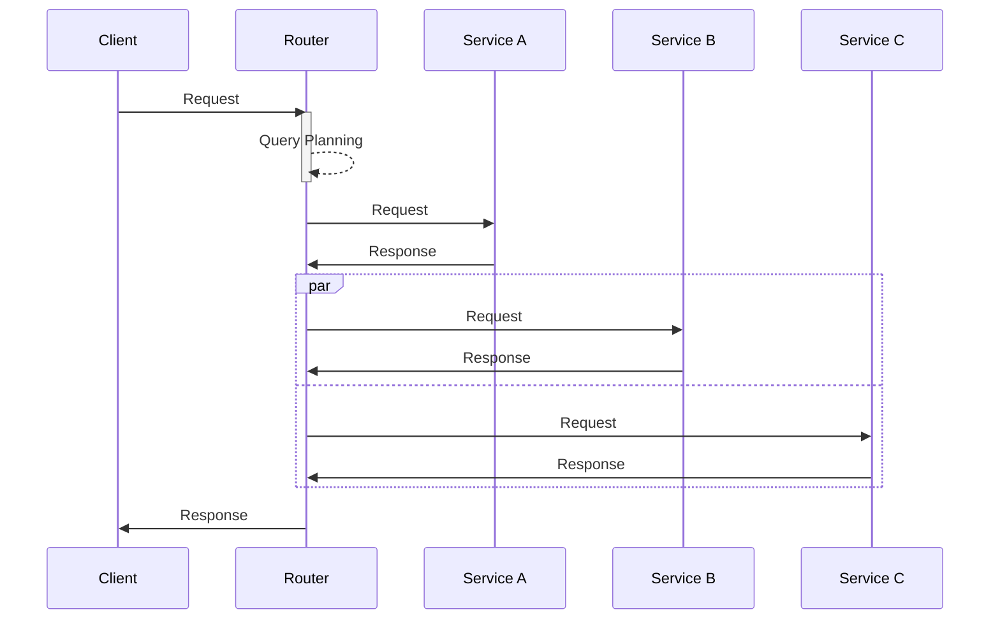

# Federation

## Preface

API federation facilitates providing access to data from numerous underlying services via a single endpoint. This hides the complexity of the underlying implementation from clients.

There are numerous methodologies for federating between GraphQL services. The Graph utilizes [Apollo Federation v2](https://www.apollographql.com/docs/federation/subgraph-spec/) which is the most widely adopted, supported, and featureful of the methods.

## Schema Composition

In order to compose the federated API each of the comprising services must supply a [Subgraph Schema](../references/terminology.md#subgraph-schema), which are then stitched together in order to form the [Supergraph Schema](../references/terminology.md#supergraph-schema). The Subgraph Schemas act as the source of truth for the API, whilst the composed Supergraph Schema is used by the Router to perform query planning, and by clients who are making requests against the federated API.

Subgraph Schema registration for the Graph is performed by adding a schema file to the [schema directory of the graph-federation GitHub repo](https://github.com/DiamondLightSource/graph-federation/tree/main/schema). A continuous integration job will then build the Supergraph schema.

## Request Routing

At run time a proxy service known as the Router receives API requests, plans queries according to the [Supergraph](../references/terminology.md#supergraph) schema, queries the appropriate services, and constructs the response. The query planning stage allows the Router to optimally query the underlying service, taking into account any dependencies which may exist between services.

An exemplary query sequence diagram is shown below, in which the queries to services B and C are dependent on the result of the query to service A.

